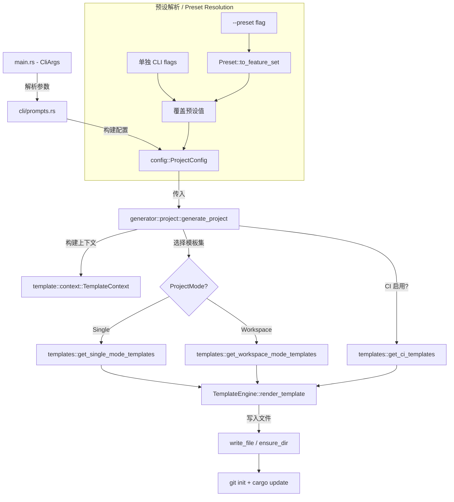
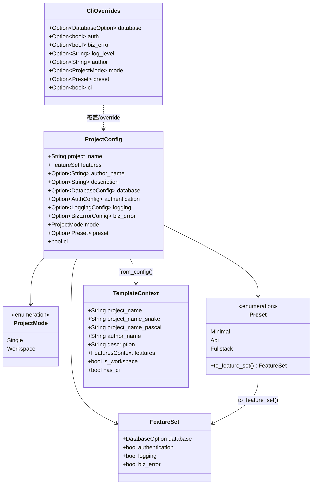
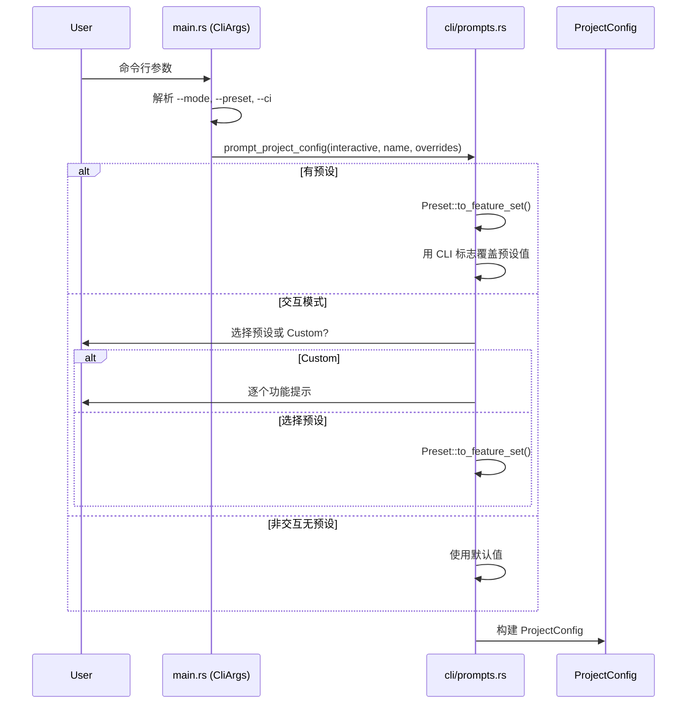

# 设计文档 / Design Document

## 概述 / Overview

本设计文档描述 `axum-app-create` v0.2.0 的三大新功能的技术实现方案：工作区模式（Workspace Mode）、配置预设（Configuration Presets）和 CI/CD 集成。设计遵循现有架构模式，通过扩展类型系统、模板注册表和生成流程来实现新功能，保持与 v0.1.1 的向后兼容性。

核心设计决策：
- 新增 `ProjectMode` 和 `Preset` 枚举类型，集成到现有 `ProjectConfig` 中
- 工作区模式使用独立的 `workspace_mode/` 模板目录，与 `single_mode/` 并行
- 预设系统作为 `FeatureSet` 的工厂方法实现，支持字段级覆盖
- CI 模板作为跨模式的附加模板，根据 `ProjectMode` 条件渲染
- 所有模板继续使用 `include_str!()` 编译时嵌入

## 架构 / Architecture

### 系统架构图 / System Architecture Diagram



### 模块变更概览 / Module Change Overview

```
src/
├── main.rs              # [修改] 新增 --mode, --preset, --ci 参数
├── config/
│   └── mod.rs           # [修改] 新增 ProjectMode, Preset 枚举; ProjectConfig 新增字段
├── cli/
│   └── prompts.rs       # [修改] 新增模式/预设/CI 提示; 预设解析逻辑; CliOverrides 扩展
├── template/
│   ├── context.rs       # [修改] TemplateContext 新增 is_workspace, has_ci 字段
│   └── templates/
│       ├── mod.rs        # [修改] 新增 get_workspace_mode_templates(), get_ci_templates()
│       └── workspace_mode/  # [新增] 工作区模式模板目录
│           ├── root/        # 根 Cargo.toml, .env.example, README 等
│           ├── api/         # api crate 模板
│           ├── domain/      # domain crate 模板
│           ├── infrastructure/ # infrastructure crate 模板
│           └── common/      # common crate 模板
├── generator/
│   └── project.rs       # [修改] 根据 ProjectMode 分支选择模板集
└── error.rs             # [无变更]
```

## 组件与接口 / Components and Interfaces

### 1. 类型系统扩展 / Type System Extensions

#### ProjectMode 枚举

```rust
// config/mod.rs

/// 项目模式 / Project generation mode
#[derive(Debug, Clone, Copy, PartialEq, Eq, Serialize, Deserialize, Default)]
pub enum ProjectMode {
    /// 单包模式（v0.1.1 行为）/ Single-package mode
    #[default]
    Single,
    /// 工作区模式 / Cargo workspace mode
    Workspace,
}

impl std::fmt::Display for ProjectMode {
    fn fmt(&self, f: &mut std::fmt::Formatter<'_>) -> std::fmt::Result {
        match self {
            Self::Single => write!(f, "single"),
            Self::Workspace => write!(f, "workspace"),
        }
    }
}
```

#### Preset 枚举

```rust
// config/mod.rs

/// 配置预设 / Configuration preset
#[derive(Debug, Clone, Copy, PartialEq, Eq, Serialize, Deserialize)]
pub enum Preset {
    /// 最小配置 / Minimal - no optional features
    Minimal,
    /// API 开发 / API - PostgreSQL + auth + logging + biz-error
    Api,
    /// 全栈开发 / Fullstack - Both DBs + auth + logging + biz-error
    Fullstack,
}

impl Preset {
    /// 将预设转换为功能集 / Convert preset to FeatureSet
    pub fn to_feature_set(&self) -> FeatureSet {
        match self {
            Self::Minimal => FeatureSet {
                database: DatabaseOption::None,
                authentication: false,
                logging: true,
                biz_error: false,
            },
            Self::Api => FeatureSet {
                database: DatabaseOption::PostgreSQL,
                authentication: true,
                logging: true,
                biz_error: true,
            },
            Self::Fullstack => FeatureSet {
                database: DatabaseOption::Both,
                authentication: true,
                logging: true,
                biz_error: true,
            },
        }
    }
}

impl std::fmt::Display for Preset {
    fn fmt(&self, f: &mut std::fmt::Formatter<'_>) -> std::fmt::Result {
        match self {
            Self::Minimal => write!(f, "minimal"),
            Self::Api => write!(f, "api"),
            Self::Fullstack => write!(f, "fullstack"),
        }
    }
}
```

#### ProjectConfig 扩展

```rust
// config/mod.rs - ProjectConfig 新增字段

pub struct ProjectConfig {
    // ... 现有字段保持不变 ...
    pub project_name: String,
    pub features: FeatureSet,
    pub author_name: Option<String>,
    pub description: Option<String>,
    pub database: Option<DatabaseConfig>,
    pub authentication: Option<AuthConfig>,
    pub logging: Option<LoggingConfig>,
    pub biz_error: Option<BizErrorConfig>,

    // 新增字段 / New fields
    /// 项目模式 / Project mode (single or workspace)
    pub mode: ProjectMode,
    /// 使用的预设 / Preset used (if any)
    pub preset: Option<Preset>,
    /// 是否生成 CI/CD 配置 / Whether to generate CI/CD config
    pub ci: bool,
}
```

#### CliOverrides 扩展

```rust
// cli/prompts.rs - CliOverrides 新增字段

pub struct CliOverrides {
    // ... 现有字段 ...
    pub database: Option<DatabaseOption>,
    pub auth: Option<bool>,
    pub biz_error: Option<bool>,
    pub log_level: Option<String>,
    pub author: Option<String>,

    // 新增字段 / New fields
    pub mode: Option<ProjectMode>,
    pub preset: Option<Preset>,
    pub ci: Option<bool>,
}
```

### 2. CLI 参数扩展 / CLI Arguments Extension

```rust
// main.rs - CliArgs 新增参数

struct CliArgs {
    // ... 现有参数保持不变 ...

    /// Project mode: single (default) or workspace
    #[arg(long, value_name = "MODE")]
    mode: Option<String>,

    /// Configuration preset: minimal, api, or fullstack
    #[arg(long, value_name = "PRESET")]
    preset: Option<String>,

    /// Generate GitHub Actions CI/CD workflow
    #[arg(long)]
    ci: bool,
}
```

参数解析逻辑在 `main.rs` 中处理，与现有的 `--database` 解析模式一致：将字符串值映射为枚举，无效值输出错误并退出。

### 3. 交互式提示扩展 / Interactive Prompts Extension

`prompt_project_config()` 函数的提示顺序调整为：

1. 项目名称（不变）
2. 作者名称（不变）
3. 项目描述（不变）
4. **模式选择**（新增）：`Single package` / `Workspace (multi-crate)`
5. **预设选择**（新增）：`Minimal` / `API` / `Fullstack` / `Custom`
6. 功能选择（仅当预设为 Custom 或未指定时）
7. **CI/CD 选择**（新增）：`Yes` / `No`

预设解析优先级实现：
```rust
// 伪代码 / Pseudocode
fn resolve_features(preset: Option<Preset>, overrides: &CliOverrides, interactive: bool) -> FeatureSet {
    let base = match preset {
        Some(p) => p.to_feature_set(),
        None if interactive => prompt_preset_or_custom(),
        None => FeatureSet::default(),
    };

    // 单独 CLI 标志覆盖预设值
    FeatureSet {
        database: overrides.database.unwrap_or(base.database),
        authentication: overrides.auth.unwrap_or(base.authentication),
        logging: base.logging, // 始终启用
        biz_error: overrides.biz_error.unwrap_or(base.biz_error),
    }
}
```

### 4. 模板上下文扩展 / Template Context Extension

```rust
// template/context.rs - TemplateContext 新增字段

pub struct TemplateContext {
    // ... 现有字段保持不变 ...

    // 新增字段 / New fields
    /// 是否为工作区模式 / Whether workspace mode
    pub is_workspace: bool,

    /// 是否生成 CI/CD / Whether CI/CD is enabled
    pub has_ci: bool,
}
```

`TemplateContext::from_config()` 扩展：
```rust
impl TemplateContext {
    pub fn from_config(config: &ProjectConfig) -> Self {
        Self {
            // ... 现有字段映射 ...
            is_workspace: config.mode == ProjectMode::Workspace,
            has_ci: config.ci,
        }
    }
}
```

### 5. 模板注册表扩展 / Template Registry Extension

#### 工作区模式模板结构

```
workspace_mode/
├── root/
│   ├── Cargo.toml.hbs          # [workspace] 根配置
│   ├── .env.example.hbs
│   ├── .gitignore
│   ├── .dockerignore
│   ├── README.md.hbs
│   └── Dockerfile.hbs
├── api/
│   ├── Cargo.toml.hbs          # 二进制 crate，依赖 domain + infrastructure
│   ├── src/
│   │   ├── main.rs.hbs         # HTTP 服务入口
│   │   ├── lib.rs.hbs
│   │   ├── config.rs.hbs
│   │   ├── handlers/
│   │   │   ├── mod.rs.hbs
│   │   │   ├── health.rs.hbs
│   │   │   └── auth.rs.hbs     # {{#if has_auth}}
│   │   └── middleware/
│   │       └── mod.rs.hbs      # {{#if has_auth}} JWT middleware
├── domain/
│   ├── Cargo.toml.hbs          # 纯库 crate，最小依赖
│   └── src/
│       ├── lib.rs.hbs
│       ├── entities/
│       │   └── mod.rs.hbs
│       └── traits/
│           └── mod.rs.hbs      # Repository traits 等
├── infrastructure/
│   ├── Cargo.toml.hbs          # 库 crate，依赖 domain
│   └── src/
│       ├── lib.rs.hbs
│       └── db.rs.hbs           # {{#if has_database}}
└── common/
    ├── Cargo.toml.hbs          # 库 crate，共享类型
    └── src/
        ├── lib.rs.hbs
        └── error.rs.hbs        # {{#if has_biz_error}}
```

#### CI 模板

```
ci/
└── .github/
    └── workflows/
        └── ci.yml.hbs          # 使用 {{#if is_workspace}} 条件
```

#### 注册表函数

```rust
// template/templates/mod.rs

/// 获取工作区模式模板 / Get workspace mode templates
pub fn get_workspace_mode_templates() -> HashMap<&'static str, TemplateFile> {
    let mut templates = HashMap::new();

    // 根目录文件 / Root files
    templates.insert("Cargo.toml", TemplateFile {
        path: "Cargo.toml",
        content: include_str!("workspace_mode/root/Cargo.toml.hbs"),
        executable: false,
    });

    // api crate 文件
    templates.insert("api/Cargo.toml", TemplateFile {
        path: "api/Cargo.toml",
        content: include_str!("workspace_mode/api/Cargo.toml.hbs"),
        executable: false,
    });
    // ... 其余模板文件 ...

    templates
}

/// 获取 CI 模板 / Get CI templates
pub fn get_ci_templates() -> HashMap<&'static str, TemplateFile> {
    let mut templates = HashMap::new();

    templates.insert(".github/workflows/ci.yml", TemplateFile {
        path: ".github/workflows/ci.yml",
        content: include_str!("ci/.github/workflows/ci.yml.hbs"),
        executable: false,
    });

    templates
}
```

### 6. 生成器流程扩展 / Generator Flow Extension

```rust
// generator/project.rs - generate_project() 修改

pub fn generate_project(
    project_dir: &Path,
    config: &ProjectConfig,
    interactive: bool,
    force: bool,
) -> Result<()> {
    // ... 现有的目录验证和创建逻辑不变 ...

    let ctx = TemplateContext::from_config(config);
    let engine = TemplateEngine::new();

    // 根据模式选择模板集 / Select templates based on mode
    let mut templates = match config.mode {
        ProjectMode::Single => get_single_mode_templates(),
        ProjectMode::Workspace => get_workspace_mode_templates(),
    };

    // 追加 CI 模板（如果启用）/ Append CI templates if enabled
    if config.ci {
        templates.extend(get_ci_templates());
    }

    // ... 现有的渲染和写入逻辑不变 ...
    // ... git init + cargo update 不变 ...
}
```

## 数据模型 / Data Models

### 核心类型关系 / Core Type Relationships



### 配置解析流程 / Configuration Resolution Flow



### 工作区 Cargo.toml 根模板示例 / Workspace Root Cargo.toml Template

```handlebars
[workspace]
members = [
    "api",
    "domain",
    "infrastructure",
    "common",
]
resolver = "2"

[workspace.package]
version = "0.1.0"
edition = "2024"
authors = ["{{author_name}}"]
```

### API Crate Cargo.toml 模板示例 / API Crate Cargo.toml Template

```handlebars
[package]
name = "{{project_name}}-api"
version.workspace = true
edition.workspace = true
authors.workspace = true

[[bin]]
name = "{{project_name}}"
path = "src/main.rs"

[dependencies]
{{project_name}}-domain = { path = "../domain" }
{{project_name}}-infrastructure = { path = "../infrastructure" }
{{project_name}}-common = { path = "../common" }

axum = "0.8"
tokio = { version = "1", features = ["full"] }
tracing = "0.1"
tracing-subscriber = { version = "0.3", features = ["env-filter"] }
serde = { version = "1", features = ["derive"] }
serde_json = "1"
anyhow = "1"

{{#if has_auth}}
jsonwebtoken = "10"
{{/if}}
```

### CI 工作流模板示例 / CI Workflow Template

```handlebars
name: CI

on:
  push:
    branches: [main, master]
  pull_request:
    branches: [main, master]

env:
  CARGO_TERM_COLOR: always

jobs:
  check:
    name: Check
    runs-on: ubuntu-latest
    steps:
      - uses: actions/checkout@v4
      - uses: dtolnay/rust-toolchain@stable
      - uses: Swatinem/rust-cache@v2
      - run: cargo check {{#if is_workspace}}--workspace{{/if}}

  test:
    name: Test
    runs-on: ubuntu-latest
    steps:
      - uses: actions/checkout@v4
      - uses: dtolnay/rust-toolchain@stable
      - uses: Swatinem/rust-cache@v2
      - run: cargo test {{#if is_workspace}}--workspace{{/if}}

  fmt:
    name: Format
    runs-on: ubuntu-latest
    steps:
      - uses: actions/checkout@v4
      - uses: dtolnay/rust-toolchain@stable
        with:
          components: rustfmt
      - run: cargo fmt --all -- --check

  clippy:
    name: Clippy
    runs-on: ubuntu-latest
    steps:
      - uses: actions/checkout@v4
      - uses: dtolnay/rust-toolchain@stable
        with:
          components: clippy
      - uses: Swatinem/rust-cache@v2
      - run: cargo clippy {{#if is_workspace}}--workspace{{/if}} -- -D warnings
```
