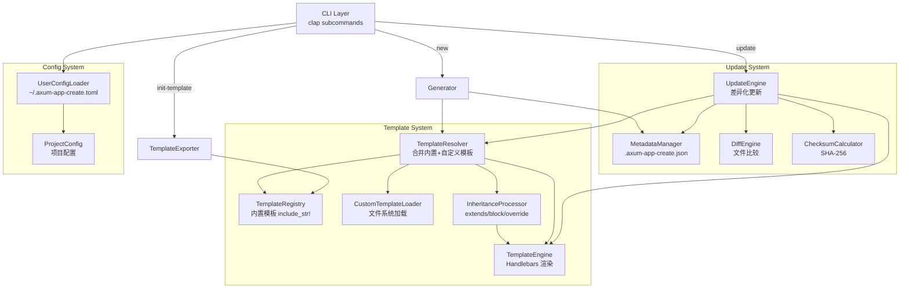
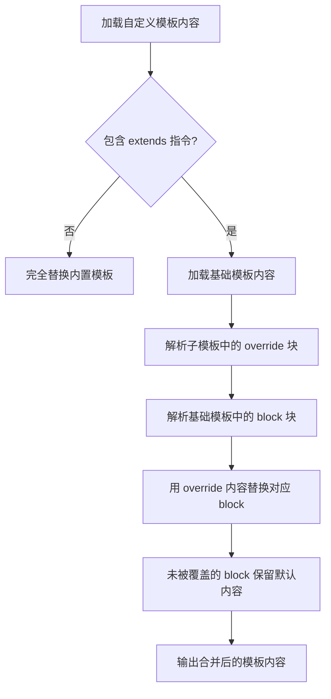
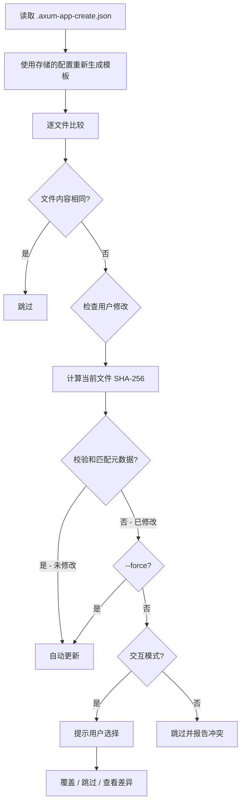

# 设计文档 / Design Document

## 概述 / Overview

v0.3.0 为 `axum-app-create` 引入三大功能：自定义模板系统、模板继承和项目更新机制。设计目标是在保持现有架构不变的前提下，通过新增模块扩展功能。

This design covers three major features for v0.3.0: Custom Template System, Template Inheritance, and Project Update Mechanism. The design goal is to extend functionality by adding new modules while keeping the existing architecture intact.

核心设计决策 / Key design decisions:
- 新增 `TemplateResolver` 模块负责合并内置模板与自定义模板，保持 `TemplateEngine` 职责单一
- 模板继承通过自定义 Handlebars helpers（`block` / `override`）实现，利用两阶段渲染
- 更新机制基于 SHA-256 校验和检测用户修改，避免覆盖自定义代码
- 用户配置文件使用 TOML 格式，通过 `toml` crate 解析
- CLI 从扁平参数结构迁移到 clap 子命令架构（`new`/`init-template`/`update`）

## 架构 / Architecture



### 模块职责 / Module Responsibilities

| 模块 / Module | 职责 / Responsibility | 文件 / File |
|---|---|---|
| TemplateResolver | 合并内置模板与自定义模板，处理覆盖优先级 | `src/template/resolver.rs` |
| CustomTemplateLoader | 从文件系统递归加载自定义模板 | `src/template/custom_loader.rs` |
| InheritanceProcessor | 解析 `extends` 指令，处理 `block`/`override` 合并 | `src/template/inheritance.rs` |
| TemplateExporter | 将内置模板导出到文件系统 | `src/template/exporter.rs` |
| UpdateEngine | 编排项目更新流程 | `src/updater/engine.rs` |
| MetadataManager | 读写 `.axum-app-create.json` | `src/updater/metadata.rs` |
| ChecksumCalculator | 计算文件 SHA-256 校验和 | `src/updater/checksum.rs` |
| UserConfigLoader | 解析 `~/.axum-app-create.toml` | `src/config/user_config.rs` |

## 组件与接口 / Components and Interfaces

### 1. TemplateResolver（模板解析器）

```rust
/// 模板解析器：合并内置模板与自定义模板
/// Template resolver: merges built-in and custom templates
pub struct TemplateResolver {
    custom_template_dir: Option<PathBuf>,
}

impl TemplateResolver {
    pub fn new(custom_template_dir: Option<PathBuf>) -> Self;

    /// 解析最终模板集合 / Resolve final template set
    /// 1. 加载内置模板（根据 ProjectMode）
    /// 2. 如果有自定义模板目录，加载自定义模板
    /// 3. 自定义模板覆盖同路径的内置模板，新路径的模板被添加
    /// 4. 处理模板继承（extends 指令）
    /// Returns: HashMap<String, ResolvedTemplate>
    pub fn resolve(
        &self,
        mode: ProjectMode,
        ci_enabled: bool,
    ) -> Result<HashMap<String, ResolvedTemplate>>;
}

/// 解析后的模板 / A resolved template ready for rendering
pub struct ResolvedTemplate {
    /// 输出文件的相对路径 / Relative path in generated project
    pub path: String,
    /// 最终模板内容（已处理继承）/ Final template content (inheritance processed)
    pub content: String,
    /// 是否可执行 / Whether the file is executable
    pub executable: bool,
}
```

### 2. CustomTemplateLoader（自定义模板加载器）

```rust
/// 从文件系统加载自定义模板
/// Load custom templates from filesystem
pub struct CustomTemplateLoader;

impl CustomTemplateLoader {
    /// 递归扫描目录，加载所有 .hbs 文件
    /// Recursively scan directory, load all .hbs files
    /// 返回 HashMap<相对路径, 文件内容>
    pub fn load(dir: &Path) -> Result<HashMap<String, String>>;
}
```

### 3. InheritanceProcessor（继承处理器）

```rust
/// 模板继承处理器
/// Template inheritance processor
pub struct InheritanceProcessor;

impl InheritanceProcessor {
    /// 解析模板中的 extends 指令
    /// Parse extends directive from template content
    /// Returns: Some(base_template_path) or None
    pub fn parse_extends(content: &str) -> Option<String>;

    /// 解析模板中的 override 块
    /// Parse override blocks from child template
    /// Returns: HashMap<block_name, override_content>
    pub fn parse_overrides(content: &str) -> HashMap<String, String>;

    /// 将基础模板中的 block 替换为子模板的 override 内容
    /// Replace blocks in base template with child overrides
    pub fn apply_inheritance(
        base_content: &str,
        overrides: &HashMap<String, String>,
    ) -> Result<String>;
}
```

### 4. TemplateExporter（模板导出器）

```rust
/// 将内置模板导出到文件系统
/// Export built-in templates to filesystem
pub struct TemplateExporter;

impl TemplateExporter {
    /// 导出指定模式的内置模板到目标目录
    /// Export built-in templates for given mode to target directory
    pub fn export(mode: ProjectMode, output_dir: &Path) -> Result<()>;
}
```

### 5. UpdateEngine（更新引擎）

```rust
/// 项目更新引擎
/// Project update engine
pub struct UpdateEngine {
    project_dir: PathBuf,
    dry_run: bool,
    force: bool,
}

impl UpdateEngine {
    pub fn new(project_dir: PathBuf, dry_run: bool, force: bool) -> Self;

    /// 执行更新流程 / Execute update workflow
    /// 1. 读取 .axum-app-create.json
    /// 2. 使用存储的配置重新生成模板
    /// 3. 逐文件比较，检测用户修改
    /// 4. 应用更新（或 dry-run 模式下仅显示）
    pub fn update(&self, interactive: bool) -> Result<UpdateReport>;
}

/// 更新报告 / Update report
pub struct UpdateReport {
    pub files_updated: Vec<String>,
    pub files_skipped: Vec<String>,
    pub files_conflicted: Vec<String>,
    pub files_created: Vec<String>,
}
```

### 6. MetadataManager（元数据管理器）

```rust
/// 生成元数据管理
/// Generation metadata management
pub struct MetadataManager;

impl MetadataManager {
    /// 创建元数据 / Create metadata for a newly generated project
    pub fn create(
        project_dir: &Path,
        config: &ProjectConfig,
        file_checksums: HashMap<String, String>,
    ) -> Result<()>;

    /// 读取元数据 / Read metadata from existing project
    pub fn read(project_dir: &Path) -> Result<GenerationMetadata>;

    /// 更新元数据 / Update metadata after an update operation
    pub fn update(
        project_dir: &Path,
        file_checksums: HashMap<String, String>,
    ) -> Result<()>;
}

/// 生成元数据结构 / Generation metadata structure
#[derive(Debug, Serialize, Deserialize)]
pub struct GenerationMetadata {
    pub version: String,
    pub generated_at: String,
    pub config: ProjectConfig,
    pub file_checksums: HashMap<String, String>,
}
```

### 7. ChecksumCalculator（校验和计算器）

```rust
/// SHA-256 校验和计算
/// SHA-256 checksum calculation
pub struct ChecksumCalculator;

impl ChecksumCalculator {
    /// 计算文件内容的 SHA-256 校验和
    /// Calculate SHA-256 checksum of file content
    pub fn calculate(content: &[u8]) -> String;

    /// 计算目录中所有文件的校验和
    /// Calculate checksums for all files in a directory
    pub fn calculate_all(project_dir: &Path, files: &[String]) -> Result<HashMap<String, String>>;
}
```

### 8. UserConfigLoader（用户配置加载器）

```rust
/// 用户级配置文件
/// User-level configuration file
#[derive(Debug, Deserialize, Default)]
pub struct UserConfig {
    pub template_dir: Option<PathBuf>,
}

impl UserConfig {
    /// 从 ~/.axum-app-create.toml 加载配置
    /// Load config from ~/.axum-app-create.toml
    /// Returns Default if file doesn't exist or is invalid
    pub fn load() -> Self;
}
```

### 9. CLI 子命令结构 / CLI Subcommand Structure

```rust
/// 顶层 CLI 结构（使用 clap 子命令）
/// Top-level CLI structure (using clap subcommands)
#[derive(Parser)]
#[command(name = "axum-app-create", version = "0.3.0")]
struct Cli {
    #[command(subcommand)]
    command: Option<Commands>,

    // 保留现有的顶层参数用于向后兼容（无子命令时等同于 `new`）
    // Retain top-level args for backward compatibility (no subcommand = `new`)
    #[arg(value_name = "PROJECT_NAME")]
    project_name: Option<String>,

    // ... 现有参数保持不变 ...
}

#[derive(Subcommand)]
enum Commands {
    /// 创建新项目 / Create a new project
    New {
        project_name: Option<String>,
        #[arg(long)]
        template_dir: Option<PathBuf>,
        // ... 其他现有参数 ...
    },
    /// 导出内置模板 / Export built-in templates
    InitTemplate {
        #[arg(default_value = "./templates")]
        output_dir: PathBuf,
        #[arg(long, default_value = "single")]
        mode: String,
    },
    /// 更新已生成的项目 / Update a generated project
    Update {
        #[arg(default_value = ".")]
        project_dir: PathBuf,
        #[arg(long)]
        dry_run: bool,
        #[arg(long)]
        force: bool,
    },
}
```

**向后兼容策略 / Backward Compatibility Strategy**: 当用户不使用子命令时（如 `axum-app-create my-app`），CLI 将其视为 `new` 子命令。这确保 v0.2.0 的所有用法继续工作。

## 数据模型 / Data Models

### GenerationMetadata（`.axum-app-create.json`）

```json
{
  "version": "0.3.0",
  "generated_at": "2025-01-15T10:30:00Z",
  "config": {
    "project_name": "my-app",
    "features": {
      "database": "PostgreSQL",
      "authentication": true,
      "logging": true,
      "biz_error": false
    },
    "mode": "Single",
    "preset": "Api",
    "ci": true
  },
  "file_checksums": {
    "Cargo.toml": "a1b2c3d4e5f6...",
    "src/main.rs": "f6e5d4c3b2a1...",
    "src/lib.rs": "1a2b3c4d5e6f..."
  }
}
```

### UserConfig（`~/.axum-app-create.toml`）

```toml
# 默认自定义模板目录 / Default custom template directory
template_dir = "/home/user/.axum-templates"
```

### ResolvedTemplate（内存中的解析后模板）

```rust
pub struct ResolvedTemplate {
    /// 输出路径 / Output path (e.g. "src/main.rs")
    pub path: String,
    /// 模板内容 / Template content (Handlebars syntax)
    pub content: String,
    /// 是否可执行 / Executable flag
    pub executable: bool,
}
```

### 模板继承语法 / Template Inheritance Syntax

**基础模板（内置）/ Base template (built-in)**:
```handlebars
{{#block "imports"}}
use axum::{Router, routing::get};
use tokio::net::TcpListener;
{{/block}}

{{#block "main_body"}}
#[tokio::main]
async fn main() {
    let app = Router::new()
        {{#block "routes"}}
        .merge(handlers::health::router())
        {{/block}}
        ;
    let listener = TcpListener::bind("0.0.0.0:8080").await.unwrap();
    axum::serve(listener, app).await.unwrap();
}
{{/block}}
```

**子模板（自定义）/ Child template (custom)**:
```handlebars
{{!-- extends: single_mode/src/main.rs.hbs --}}

{{#override "imports"}}
use axum::{Router, routing::get};
use tokio::net::TcpListener;
use my_company_lib::telemetry;
{{/override}}

{{#override "routes"}}
.merge(handlers::health::router())
.merge(handlers::custom::router())
{{/override}}
```

### 继承处理流程 / Inheritance Processing Flow



### 更新流程 / Update Flow



### 新增依赖 / New Dependencies

| Crate | 版本 / Version | 用途 / Purpose |
|---|---|---|
| `sha2` | `0.10` | SHA-256 校验和计算 |
| `toml` | `0.8` | 解析用户配置文件 |
| `similar` | `2` | 文件差异比较（用于 update --dry-run 显示差异） |
| `dirs` | `6` | 跨平台获取用户 home 目录 |

## 正确性属性 / Correctness Properties

*正确性属性是在系统所有有效执行中都应成立的特征或行为——本质上是关于系统应该做什么的形式化陈述。属性作为人类可读规范与机器可验证正确性保证之间的桥梁。*

*A property is a characteristic or behavior that should hold true across all valid executions of a system — essentially, a formal statement about what the system should do. Properties serve as the bridge between human-readable specifications and machine-verifiable correctness guarantees.*

### Property 1: 模板解析覆盖与合并 / Template resolution override and merge

*For any* set of built-in templates and *any* set of custom templates, the resolved template set should: (a) use custom template content for paths that exist in both sets, (b) include custom templates for paths only in the custom set, and (c) retain built-in templates for paths only in the built-in set. The total count of resolved templates should equal the count of unique paths across both sets.

**Validates: Requirements 1.2, 1.3, 2.5**

### Property 2: 继承中块默认内容保留 / Block default content preservation in inheritance

*For any* base template containing named blocks and *any* child template that overrides a strict subset of those blocks, the merged output should contain the override content for overridden blocks and the original default content for non-overridden blocks.

**Validates: Requirements 2.2, 2.3, 2.4, 2.9**

### Property 3: extends 指令解析 / Extends directive parsing

*For any* template content string containing a valid `{{!-- extends: <path> --}}` comment directive, `parse_extends` should extract the correct base template path. For any template content without the directive, `parse_extends` should return `None`.

**Validates: Requirements 2.1**

### Property 4: 块重构向后兼容 / Block refactoring backward compatibility

*For any* `ProjectConfig`, rendering the block-refactored built-in templates (with `{{#block}}` markers) without any child overrides should produce output identical to rendering the original templates without block markers.

**Validates: Requirements 3.4, 9.1, 9.2, 9.4**

### Property 5: SHA-256 校验和确定性 / SHA-256 checksum determinism

*For any* byte sequence, computing the SHA-256 checksum twice should produce the same result. *For any* two distinct byte sequences, the checksums should differ (collision resistance).

**Validates: Requirements 6.1, 6.2, 6.3**

### Property 6: 更新分类正确性 / Update classification correctness

*For any* file in a project, given its stored checksum and new generated content: (a) if current file content equals new content, the file should be classified as "skipped"; (b) if current file content differs from new content and current checksum matches stored checksum, the file should be classified as "auto-update"; (c) if current file content differs from new content and current checksum differs from stored checksum, the file should be classified as "conflicted".

**Validates: Requirements 4.5, 4.6, 6.2, 6.3**

### Property 7: dry-run 不修改文件 / Dry-run does not modify files

*For any* project directory and update configuration with `dry_run=true`, executing the update should not modify any files on disk. The file contents before and after the update operation should be identical.

**Validates: Requirements 4.8**

### Property 8: force 覆盖所有差异文件 / Force overwrites all differing files

*For any* project directory and update configuration with `force=true`, all files that differ from the new generation should be updated, regardless of whether they were user-modified. The update report should contain zero conflicted files.

**Validates: Requirements 4.9**

### Property 9: 元数据序列化往返 / Metadata serialization round-trip

*For any* valid `GenerationMetadata` struct, serializing to JSON and then deserializing back should produce an equivalent struct.

**Validates: Requirements 4.2, 5.1, 5.2**

### Property 10: 元数据包含所有生成文件的校验和 / Metadata contains checksums for all generated files

*For any* `ProjectConfig`, after project generation, the `.axum-app-create.json` file should contain a checksum entry for every generated file, and each checksum should match the SHA-256 of the corresponding file's content on disk.

**Validates: Requirements 5.2, 5.4**

### Property 11: 模板导出往返 / Template export round-trip

*For any* `ProjectMode`, exporting built-in templates to a directory and then loading them back as custom templates should produce a template set with identical content to the original built-in templates.

**Validates: Requirements 1.7, 1.8**

### Property 12: 用户配置解析 / User config parsing

*For any* valid TOML string containing a `template_dir` field, parsing should produce a `UserConfig` with the correct `template_dir` value. *For any* invalid TOML string, parsing should return a default `UserConfig` without error.

**Validates: Requirements 7.2, 7.3, 7.4**

### Property 13: 配置优先级 / Configuration priority

*For any* combination of CLI flag value, user config value, and default value for `template_dir`, the resolved value should always be: CLI flag if present, else user config if present, else default.

**Validates: Requirements 1.10, 7.5**

## 错误处理 / Error Handling

| 场景 / Scenario | 处理方式 / Handling | 错误类型 / Error Type |
|---|---|---|
| `--template-dir` 路径不存在 | 输出双语错误信息，退出码 1 | `CliError::Config` |
| `--template-dir` 路径不是目录 | 输出双语错误信息，退出码 1 | `CliError::Config` |
| 自定义模板 Handlebars 语法错误 | 输出模板名称和行号，退出码 1 | `CliError::Template` |
| `extends` 引用不存在的基础模板 | 输出模板名称和引用路径，退出码 1 | `CliError::Template` |
| `override` 块名在基础模板中不存在 | 输出警告信息，继续执行（忽略该覆盖） | Warning (non-fatal) |
| `.axum-app-create.json` 不存在（update 时） | 输出提示信息，退出码 1 | `CliError::Config` |
| `.axum-app-create.json` 格式无效 | 输出解析错误，退出码 1 | `CliError::Config` |
| `~/.axum-app-create.toml` 格式无效 | 输出警告，使用默认值继续 | Warning (non-fatal) |
| 文件写入权限不足 | 复用现有 `handle_permission_error` | `CliError::Io` |
| `init-template` 输出目录已存在且非空 | 提示用户确认覆盖或取消 | Interactive prompt |

所有用户可见的错误信息必须为双语格式（英文 + 中文），与现有错误处理风格一致。

## 测试策略 / Testing Strategy

### 属性测试 / Property-Based Testing

使用 `proptest` crate 实现属性测试，每个属性测试至少运行 100 次迭代。

| Property | 测试方法 / Test Approach |
|---|---|
| Property 1 | 生成随机的内置模板集和自定义模板集（随机路径和内容），验证解析结果 |
| Property 2 | 生成随机的基础模板（含随机块）和子模板（覆盖随机子集），验证合并结果 |
| Property 3 | 生成随机路径字符串，构造 extends 指令，验证解析结果 |
| Property 4 | 使用多种 ProjectConfig 组合，比较有块和无块模板的渲染输出 |
| Property 5 | 生成随机字节序列，验证校验和确定性和唯一性 |
| Property 6 | 生成随机的文件状态组合（内容、校验和、新生成内容），验证分类结果 |
| Property 7 | 在临时目录中创建项目，执行 dry-run 更新，验证文件未变 |
| Property 8 | 在临时目录中创建项目并修改文件，执行 force 更新，验证所有文件已更新 |
| Property 9 | 生成随机 GenerationMetadata，序列化再反序列化，验证等价 |
| Property 10 | 使用多种 ProjectConfig 生成项目，验证元数据校验和与磁盘文件匹配 |
| Property 11 | 导出模板到临时目录，重新加载，比较内容 |
| Property 12 | 生成随机 TOML 字符串（有效和无效），验证解析结果 |
| Property 13 | 生成随机的 CLI/config/default 值组合，验证优先级 |

### 单元测试 / Unit Tests

- `InheritanceProcessor::parse_extends` — 各种格式的 extends 指令
- `InheritanceProcessor::parse_overrides` — 单个和多个 override 块
- `InheritanceProcessor::apply_inheritance` — 完整继承合并
- `ChecksumCalculator::calculate` — 已知输入的校验和
- `UserConfig::load` — 文件不存在、空文件、有效文件、无效文件
- `MetadataManager::create/read` — 创建和读取元数据
- `UpdateEngine` — 各种更新场景（跳过、自动更新、冲突）
- `TemplateExporter::export` — 导出模板到目录

### 集成测试 / Integration Tests

- 使用自定义模板目录生成项目，验证自定义内容出现在输出中
- 使用模板继承生成项目，验证覆盖块生效
- 生成项目后执行 update，验证更新流程
- 生成项目后修改文件，执行 update，验证冲突检测
- `--dry-run` 不修改文件
- `--force` 覆盖所有文件
- `init-template` 导出模板并用于生成
- 向后兼容：所有 v0.2.0 测试继续通过

### 测试配置 / Test Configuration

- 属性测试库 / PBT library: `proptest` (已在项目中使用)
- 每个属性测试最少 100 次迭代 / Minimum 100 iterations per property test
- 每个属性测试必须引用设计文档中的属性编号 / Each test must reference design property number
- 标签格式 / Tag format: `Feature: v030-template-and-update, Property N: <property_text>`
